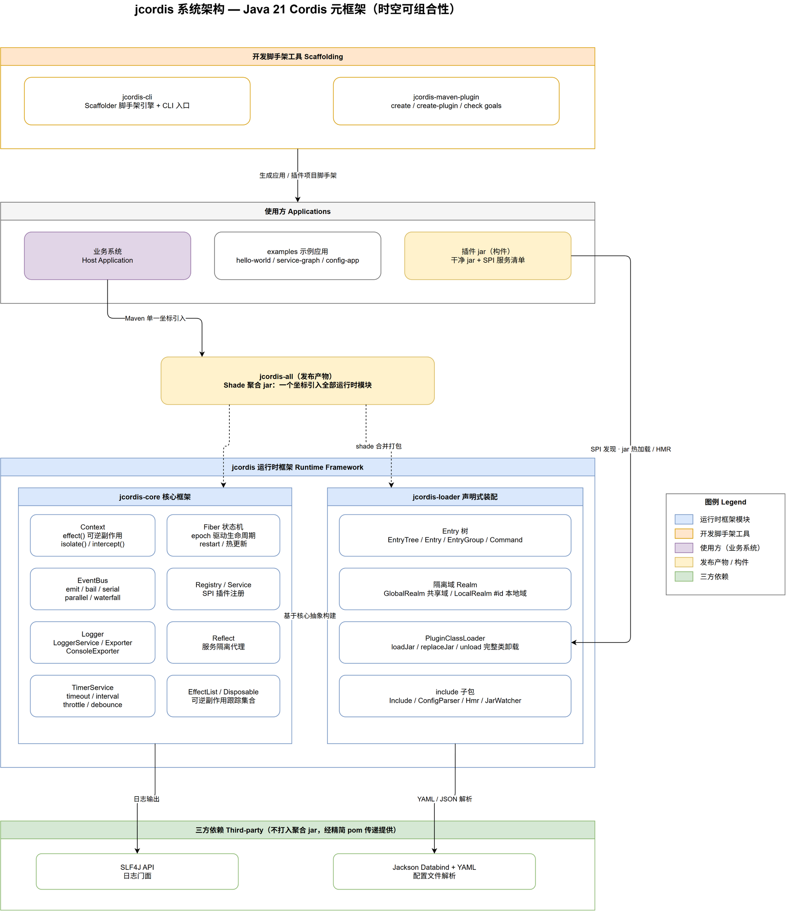

# jcordis

<p align="left">
  English | <a href="README.zh-CN.md">简体中文</a>
</p>

<p align="left">
  
  
  
</p>

**jcordis** is a Java 21 implementation of **Cordis** — a meta-framework of spatiotemporal composability.

Reference project: [cordiverse/cordis](https://github.com/cordiverse/cordis) (TypeScript)

## Architecture Overview

```
Scaffolding tools ──generate──> Consumers (business apps / examples / plugin jars)
                                     │ single Maven coordinate
                                     ▼
                           jcordis-all (shaded aggregate jar)
                                     │ shade merge
                                     ▼
          jcordis runtime framework = jcordis-core + jcordis-loader
                                     │
                                     ▼
              Third-party dependencies (SLF4J / Jackson, provided transitively)
```



> Editable source: [docs/architecture.drawio](docs/architecture.drawio) (open in draw.io to keep editing)

## Core Features

- **Spatiotemporal composability**: `ctx.effect()` registers reversible side effects (temporal composition), cleaned up in reverse order when a plugin is destroyed; `ctx.isolate()` / `ctx.intercept()` build service isolation domains (spatial composition)
- **Event system**: five dispatch modes — emit / bail / serial / parallel / waterfall — with thisArg filtering; internal waterfalls (`internal/get`, `internal/set`) allow intercepting service access, `internal/status` reports fiber state transitions
- **Plugin lifecycle**: Fiber state machine driven by dependency epochs (auto-loads when injections are ready, auto-unloads when missing), `restart()` / hot config updates, `getEffects()` introspection; failed bodies only recover through `update()`; async bodies (returning `CompletableFuture`) collect disposables on completion and never leak when the fiber was torn down first
- **Declarative loader**: Entry tree + config diff synchronization (YAML/JSON parsed via `ConfigParser` strategies) + isolation realms (`Realm`: `#id` local / `@label` shared, garbage-collected when unreferenced) + entry `inject` merge, `await` readiness gating, `transfer(id, parent)` across groups, `locate()`
- **Plugin hot reload (HMR)**: runtime plugin loading from jars (SPI discovery + dedicated `PluginClassLoader`), jar hot-swap on change (atomic replacement + rollback on failure), complete class unloading; config-file hot reload via `Hmr` (see the `examples/hmr-app` demo)
- **Scaffolding**: dual entry points (Maven plugin / CLI) to generate application and plugin projects
- **Concurrency-safe**: per-fiber monitor lock (snapshot-and-dispose, never holding the lock into user callbacks), atomic service registration (`putIfAbsent`), thread-safe effect collections and dependency caches — see [Concurrency Model](#concurrency-model)

## Module Structure

| Module | Description | Depends on |
|---|---|---|
| `jcordis-core` | Core framework: Context / Fiber state machine / EventBus / Registry / Logger (with ConsoleExporter) / Reflect (service isolation) + `EffectList` (effect-tracking collection) + `TimerService` (timeout/interval/throttle/debounce) | — |
| `jcordis-loader` | Entry tree / config reconciliation / isolation realms / plugin jar loading (`PluginClassLoader`, `loadJar`/`replaceJar`/`unload`) + `include` subpackage (config-file plugin `Include` / `ConfigParser` / HMR `Hmr` / `JarWatcher` hot-swap) + grouping markers | core |
| `jcordis-cli` | `Scaffolder` engine + CLI entry point | core |
| `jcordis-maven-plugin` | Maven plugin: `create` / `create-plugin` / `check` | — |
| `jcordis-all` | **Aggregate jar**: shades all runtime modules (except maven-plugin) into a single jar — one coordinate for business systems | core + loader + cli |
| `examples/*` | hello-world / service-graph / config-app / hmr-app (hot reload demo) examples + demo-plugin (standalone plugin example, not part of the reactor build) | — |

## Requirements

- JDK 21+
- Maven 3.x

## Quick Start

**Create an application scaffold** (identical to the CLI output):

```bash
mvn io.jcordis:jcordis-maven-plugin:1.0.1-SNAPSHOT:create -Dname=my-app
```

**Create a plugin scaffold** (embedded plugin contract: jcordis dependency as provided + SPI manifest + check goal):

```bash
mvn io.jcordis:jcordis-maven-plugin:1.0.1-SNAPSHOT:create-plugin -Dname=demo-plugin
```

## Examples

| Example | Demonstrates | Run |
|---|---|---|
| `examples/hello-world` | minimal plugin lifecycle (load/unload) | `mvn -pl examples/hello-world exec:java` |
| `examples/service-graph` | service provide / dependency / isolation, dependency response | `mvn -pl examples/service-graph exec:java` |
| `examples/config-app` | YAML config + include + group | `mvn -pl examples/config-app test` |
| `examples/hmr-app` | config hot reload + plugin jar hot-swap | `mvn -pl examples/hmr-app exec:java` (edit `jcordis.yml` / `plugins/` to watch it reload) |

**Sample output** (JDK 21, Windows):

```text
$ mvn -pl examples/hello-world exec:java
2026-09-02 10:03:12 [I] hello hello world from jcordis
--- unloading the plugin ---
2026-09-02 10:03:12 [I] hello goodbye

$ mvn -pl examples/service-graph exec:java
app connected; database connections = 1
app fiber state after provider removal = PENDING

$ mvn -pl examples/config-app exec:java
entries loaded: 3 (feature-a + group + nested-feature)

$ mvn -pl examples/hmr-app exec:java
[hmr-app] watching ...jcordis.yml (config) and ...plugins (plugin jars)
[hmr-app] edit jcordis.yml or swap plugins/*.jar to see hot reload
```

## Concurrency Model

Plugin bodies are synchronous by default; an async body returns a
`CompletableFuture` (e.g. an async `init`). When an async body completes, its
resulting disposable is collected under a per-fiber **monitor lock** (the
concurrency pattern), and the state transition races are resolved so that:

- a disposable produced by a body that completes <em>after</em> the fiber was
torn down is disposed immediately — never leaked (mirrors `dispose.spec`
`async return 2`);
- a body failure arriving after disposal is ignored — the fiber stays
`DISPOSED`, not `FAILED`;
- effect teardown snapshots the collection under the lock and invokes user
callbacks <em>outside</em> it, so disposers may safely call back into the
fiber (e.g. `ctx.effect` / `ctx.get`).

## Business System Integration

One coordinate brings in the whole runtime framework (core + loader, including the timer / console-exporter / include / group / utils functionality merged into them):

```xml
<dependency>
  <groupId>io.jcordis</groupId>
  <artifactId>jcordis-all</artifactId>
  <version>1.0.1-SNAPSHOT</version>
</dependency>
```

Third-party libraries (jackson/slf4j) are not shaded into the aggregate jar; they are provided transitively via the reduced pom.

## Plugin Development

Plugin projects produce a **clean jar**: only plugin classes + a `META-INF/services/io.jcordis.core.registry.Plugin` manifest.

- `mvn verify` automatically runs the `check` goal, verifying that no third-party / framework classes are mixed into the plugin jar
- At runtime the plugin is loaded in isolation by `PluginClassLoader`, with jar hot-swap and complete class unloading
- Full contract details: see the [plugin development guide](docs/plugin-development.md) (English) and the [HMR design doc](docs/hmr-design.md) (Chinese)

## Documentation

| Document | Description |
|---|---|
| [Cordis source analysis](docs/cordis-analysis.md) | Full architecture analysis of the reference project (Chinese) |
| [Java 21 porting roadmap](docs/roadmap.md) | Phased porting plan (Chinese) |
| [Progress log](docs/progress.md) | Implementation milestones and verification results (Chinese) |
| [Design patterns](docs/patterns.md) | 23 GoF patterns applied (Chinese) |
| [HMR design](docs/hmr-design.md) | ClassLoader hot-swap, unload semantics, dependency model (Chinese) |
| [Plugin development](docs/plugin-development.md) | Plugin contract, packaging, isolation, hot reload (English) |
| [Performance benchmark](docs/perf.md) | Throughput baselines (ns/op), comparison vs Cordis |
| [Compatibility matrix](docs/compatibility.md) | cordis API mapping (Chinese) |

## Build & Test

```bash
mvn clean verify   # 10/10 modules, 206 tests green
mvn -Pcoverage clean verify   # jacoco coverage gate (LINE >= 80%, BRANCH >= 60%)
mvn -Pbenchmark -pl jcordis-core test -Dtest=JmhRunnerTest   # JMH benchmarks
```

## Code Coverage

- **Local report**: after a coverage run, open
  `jcordis-core/target/site/jacoco/index.html` (and the same path in each
  module) in a browser.
- **Cloud dashboard** (CI uploads automatically when the `CODECOV_TOKEN`
  secret is configured on the repository):
  <https://app.codecov.io/github/yhnnhyyhnn/jcordis> — per-commit history,
  module/package/class drill-down and PR coverage comments.

  The upload token lives only in the repository secret — it is never stored
  in the codebase.
